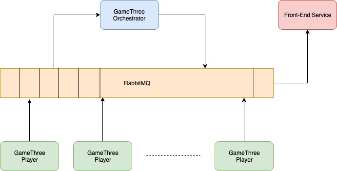

#Implementation of "Game of Three"

Architecture of the game, based on Orchestrator service that controls whole game flow 
and Player service that initiates player’s actions. Each player sends his/her action event 
to the RabbitMQ where collects by queues of orchestrator. 
Orchestrator reads each single event from queue and responds to proper user’s queue. 
This service makes decision about who win the game.  
Following design provides ability to connect front-end service , 
continuously receive game state events and draw UI.




##How to play game

There are 2 java projects
- Generate jar files of Client and Orchestrator with following commond:
```$xslt
mvn clean compile assembly:single
```
- Install RabbitMq (https://www.rabbitmq.com/install-homebrew.html)
- Start RabbitMq Server (rabbitmq-server start)
- Run Orchestrator and Clients on different terminals
- Play game on terminal